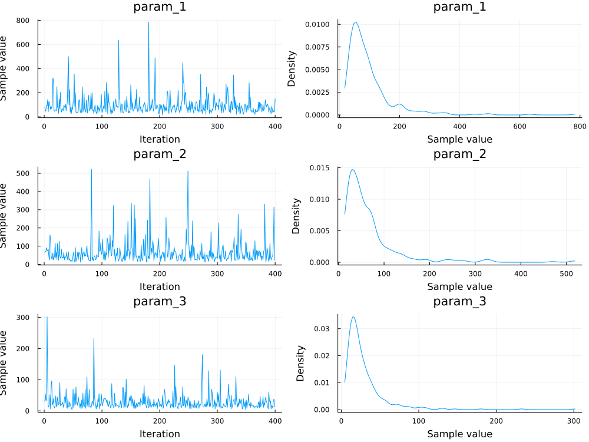

```julia
using CSV, StatsModels, DataFrames, NextGP
```

```julia
data = CSV.read("YOURPATH/phenotypes.csv",DataFrame)
```


<div class="data-frame"><p>10 rows × 6 columns</p><table class="data-frame"><thead><tr><th></th><th>ID</th><th>Sire</th><th>Dam</th><th>Herds</th><th>Pen</th><th>BW</th></tr><tr><th></th><th title="String7">String7</th><th title="String7">String7</th><th title="String7">String7</th><th title="Int64">Int64</th><th title="Int64">Int64</th><th title="Float64">Float64</th></tr></thead><tbody><tr><th>1</th><td>QGG5</td><td>QGG1</td><td>QGG2</td><td>1</td><td>1</td><td>35.0</td></tr><tr><th>2</th><td>QGG6</td><td>QGG3</td><td>QGG2</td><td>1</td><td>2</td><td>20.0</td></tr><tr><th>3</th><td>QGG7</td><td>QGG4</td><td>QGG6</td><td>1</td><td>2</td><td>25.0</td></tr><tr><th>4</th><td>QGG8</td><td>QGG3</td><td>QGG5</td><td>1</td><td>1</td><td>40.0</td></tr><tr><th>5</th><td>QGG9</td><td>QGG1</td><td>QGG6</td><td>2</td><td>1</td><td>42.0</td></tr><tr><th>6</th><td>QGG10</td><td>QGG3</td><td>QGG2</td><td>2</td><td>2</td><td>22.0</td></tr><tr><th>7</th><td>QGG11</td><td>QGG3</td><td>QGG7</td><td>2</td><td>2</td><td>35.0</td></tr><tr><th>8</th><td>QGG12</td><td>QGG8</td><td>QGG7</td><td>3</td><td>2</td><td>34.0</td></tr><tr><th>9</th><td>QGG13</td><td>QGG9</td><td>QGG2</td><td>3</td><td>1</td><td>20.0</td></tr><tr><th>10</th><td>QGG14</td><td>QGG3</td><td>QGG6</td><td>3</td><td>2</td><td>40.0</td></tr></tbody></table></div>


```julia
pedigree = "YOURPATH/pedigreeBase.txt"
```


    "YOURPATH/pedigreeBase.txt"


```julia
f = @formula(BW ~ Herds + Pen + ran(ID, ID) + ran(Dam,ID) + ran(Dam, Dam))
```


    FormulaTerm
    Response:
      BW(unknown)
    Predictors:
      Herds(unknown)
      Pen(unknown)
      (ID)->ran(ID, ID)
      (Dam,ID)->ran(Dam, ID)
      (Dam)->ran(Dam, Dam)


```julia
myHints = Dict(:Dam => StatsModels.FullDummyCoding(),:ID => StatsModels.FullDummyCoding(),:Herds => StatsModels.DummyCoding(),:Pen => StatsModels.FullDummyCoding())
```


    Dict{Symbol, AbstractContrasts} with 4 entries:
      :Pen   => FullDummyCoding()
      :ID    => FullDummyCoding()
      :Herds => DummyCoding(nothing, nothing)
      :Dam   => FullDummyCoding()


```julia
blk = [("Herds","Pen")]
```


    1-element Vector{Tuple{String, String}}:
     ("Herds", "Pen")


```julia
# later the writing will be simplified
priorVar = Dict(("ID","ID") => ("A",150),
                ("Dam","ID") => ("A",90),
                ("Dam","Dam") => ([],40),
                "e"=> ([],350))
```


    Dict{Any, Tuple{Any, Int64}} with 4 entries:
      ("Dam", "Dam") => (Any[], 40)
      "e"            => (Any[], 350)
      ("Dam", "ID")  => ("A", 90)
      ("ID", "ID")   => ("A", 150)


```julia
runGibbs(f,data,5000,1000,10;myHints=myHints,blockThese=blk,VCV=priorVar,userPedData=pedigree)
```

    MCMC progress... 100%|███████████████████████████████████| Time: 0:08:32


    outMCMC has been created to store the MCMC output
    Building parts of MME
    Herds is Term type
    Pen is Term type
    (ran(ID,ID)) is ran Type
    sym1: ID sym2: ID
    (ran(Dam,ID)) is ran Type
    sym1: Dam sym2: ID
    (ran(Dam,Dam)) is ran Type
    sym1: Dam sym2: Dam
    number of markers: Any[]
    ("Herds", "Pen")
    priorVCV structure for ("ID", "ID") is A, computed A matrix will be used
    priorVCV structure for ("Dam", "ID") is A, computed A matrix will be used
    priorVCV structure for ("Dam", "Dam") is empty, an identity matrix will be used
    e is univariate
    number of regions: Any[]


```julia
postMCMC_b = summaryMCMC("b",summary=true)
```


    Chains MCMC chain (400×4×1 Array{Float64, 3}):
    
    Iterations        = 1:1:400
    Number of chains  = 1
    Samples per chain = 400
    parameters        = param_1, param_2, param_3, param_4
    
    Summary Statistics
			mean      std      naive_se    mcse      ess       rhat    
         param_1    3.4966   11.5168     0.5758    0.5996   367.7749    1.0019
         param_2    1.9941   10.6965     0.5348    0.4786   514.1442    0.9991
         param_3   34.6249   13.1674     0.6584    0.8944   196.3730    0.9996
         param_4   26.9112   12.8549     0.6427    1.0136   199.1124    1.0003
    
...............


```julia
postMCMC_u = summaryMCMC("varU",summary=true)
```

    Chains MCMC chain (400×3×1 Array{Float64, 3}):
    
    Iterations        = 1:1:400
    Number of chains  = 1
    Samples per chain = 400
    parameters        = param_1, param_2, param_3
    
    Summary Statistics
    			mean      std      naive_se    mcse      ess       rhat
         param_1   96.1806   82.0867     4.1043    4.1074   306.2494    1.0005
         param_2   66.2353   65.5439     3.2772    4.7650   300.4542    0.9992
         param_3   29.0011   28.2076     1.4104    1.4688   346.3286    1.0012
    
................





```julia
postMCMC_e = summaryMCMC("varE",summary=true)
```


    Chains MCMC chain (400×1×1 Array{Float64, 3}):
    
    Iterations        = 1:1:400
    Number of chains  = 1
    Samples per chain = 400
    parameters        = param_1
    
    Summary Statistics
    			mean      std      naive_se    mcse      ess       rhat
         param_1   142.1475   86.5155     4.3258    3.7103   426.5393    1.0002
    
..............


